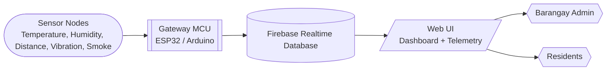
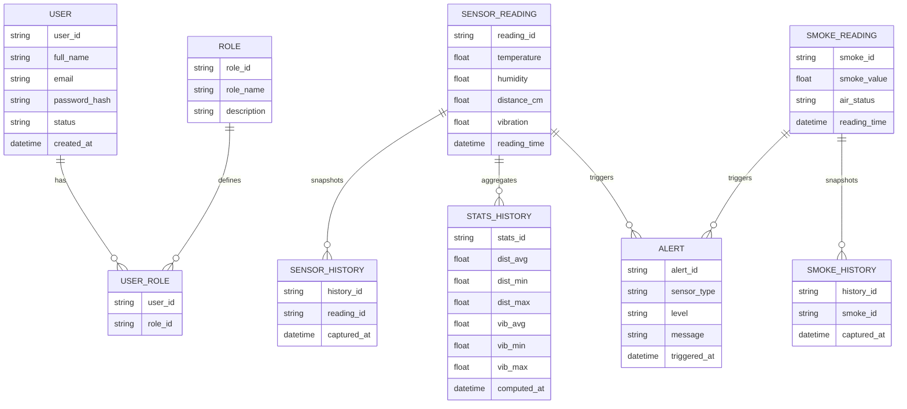
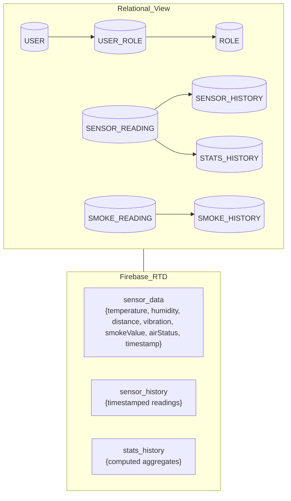
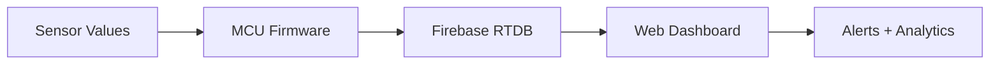
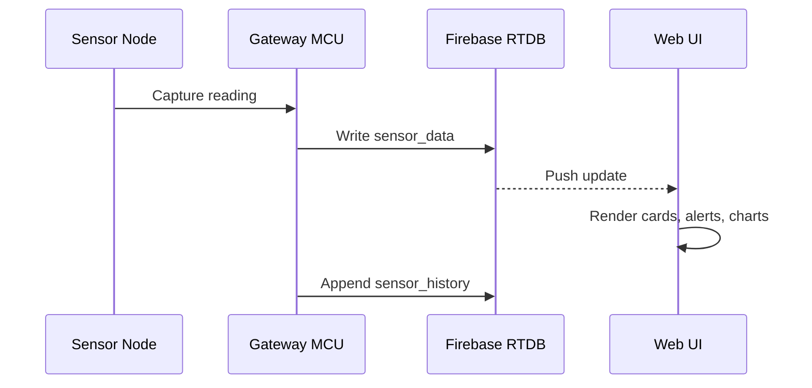
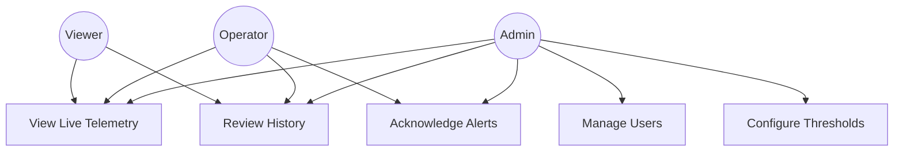
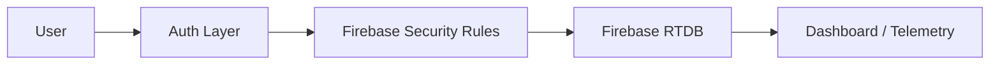

DATABASE MANAGEMENT & ADMINISTRATION 2
PROJECT DOCUMENTATION TEMPLATE

Project Title: Disaster Alert and Monitoring System (DAMS)
System Description: Web-Based Disaster Alert and Monitoring System

Cover Page
Course: Database Management & Administration 2
Project: Disaster Alert and Monitoring System (DAMS)
System Type: Web-Based Disaster Alert and Monitoring System
Date: February 10, 2026

1. Introduction
1.1 Project Overview
The Disaster Alert and Monitoring System (DAMS) is a web-based dashboard that displays real-time environmental telemetry from connected sensors. It monitors temperature, humidity, water distance (flood risk), vibration (seismic activity), and smoke levels, and shows alerts, history, and analytics. The system uses Firebase Realtime Database for live data synchronization between sensor devices and the web interface.

1.2 Objectives of the Project
- To design and implement a normalized database
- To apply database administration concepts
- To integrate database operations with a web-based system

2. Scope and Limitations
2.1 Scope
- User authentication and role management
- Database CRUD operations
- Data validation and integrity enforcement

2.2 Limitations
- Limited to small-scale users
- No real-time replication implemented

3. System Architecture
3.1 System Architecture Diagram (REQUIRED)


4. Database Requirements Analysis
4.1 Identified Entities
- SensorReading
- SmokeReading
- SensorHistory
- StatsHistory
- User
- Role

4.2 Data Requirements
- Temperature, humidity, water distance, vibration magnitude, smoke level
- Air status flags and alert thresholds
- Timestamped history (recent readings and statistics)
- User identity, role, and access level

5. Database Design
5.1 Entity Relationship Diagram (ERD) (REQUIRED)


What it MUST include
- Entities for sensor readings, history, and users
- Relationships between users and roles
- Key attributes for telemetry values and timestamps

5.2 Database Schema Diagram (REQUIRED)


5.3 Normalization
- 1NF: Each entity stores atomic values (one value per column, no repeating groups).
- 2NF: Non-key attributes fully depend on the primary key (e.g., `reading_id` identifies the full reading).
- 3NF: No transitive dependencies (user roles separated into `USER_ROLE` and `ROLE`).

6. Database Implementation
6.1 DBMS Used
- Firebase Realtime Database (NoSQL)

6.2 Sample SQL Scripts
```sql
CREATE TABLE sensor_reading (
   reading_id VARCHAR(36) PRIMARY KEY,
   temperature DECIMAL(5,2),
   humidity DECIMAL(5,2),
   distance_cm DECIMAL(5,2),
   vibration DECIMAL(5,2),
   reading_time DATETIME NOT NULL
);

CREATE TABLE smoke_reading (
   smoke_id VARCHAR(36) PRIMARY KEY,
   smoke_value DECIMAL(6,2),
   air_status VARCHAR(40),
   reading_time DATETIME NOT NULL
);

CREATE TABLE stats_history (
   stats_id VARCHAR(36) PRIMARY KEY,
   dist_avg DECIMAL(6,2),
   dist_min DECIMAL(6,2),
   dist_max DECIMAL(6,2),
   vib_avg DECIMAL(6,2),
   vib_min DECIMAL(6,2),
   vib_max DECIMAL(6,2),
   computed_at DATETIME NOT NULL
);
```

7. Database Administration Features
7.1 User Roles and Privileges
- Admin: full access, manage users, configure thresholds, view all data
- Operator: monitor live data, acknowledge alerts, export reports
- Viewer: read-only access to dashboard and telemetry history

7.2 Backup and Recovery
- Scheduled export of Firebase data to JSON
- Daily backups to offline storage or cloud bucket
- Restore procedure to re-import JSON into Firebase RTDB

7.3 Security Measures
- Firebase security rules restricting read/write per role
- HTTPS access only
- Input validation and range checks for sensor data

8. Data Flow and Transactions
8.1 Data Flow Diagram (REQUIRED)


8.2 Database Transaction Flow Diagram (REQUIRED)


9. Use Case Diagram
9.1 Use Case Diagram (REQUIRED)


What it MUST include
- Admin, Operator, Viewer
- Monitoring, history review, and alert handling

10. Security and Access Control
10.1 Security Diagram (REQUIRED)


11. Testing and Validation
11.1 Test Cases
- Verify dashboard loads and shows default placeholders when no data exists
- Verify live data updates when `sensor_data` changes
- Verify alerts trigger at threshold boundaries
- Verify history list updates with new entries

11.2 Data Integrity Testing
- Range checks for sensor values (no negative distances, valid humidity range)
- Timestamp sanity checks (monotonic and recent)
- Reject non-numeric sensor values

12. Conclusion and Recommendations
12.1 Conclusion
The DAMS system provides a responsive, web-based interface for monitoring critical environmental indicators. Its Firebase-backed realtime data flow supports live dashboards, history views, and alerting with minimal latency.

12.2 Recommendations
- Add Firebase Authentication for production use
- Implement role-based security rules
- Add automated backups and retention policies

13. Appendices
Appendix A – System Screenshots
- Include screenshots of the Dashboard and Live Telemetry pages

Appendix B – SQL Scripts
- Include the SQL schema scripts shown in Section 6.2

Appendix C – All Diagrams
- Include all Mermaid diagrams from Sections 3, 5, 8, 9, and 10

PROJECT OUTPUT INSTRUCTIONS
1. WHAT YOU ARE BUILDING
- A web-based disaster alert and monitoring system with realtime telemetry and alerts

2. WHAT YOU WILL SUBMIT (FINAL OUTPUT)
A. PROJECT DOCUMENTATION
- This README with required sections and diagrams
B. REQUIRED DIAGRAMS
- Architecture, ERD, Schema, DFD, Transaction Flow, Use Case, Security
C. SCREENSHOTS & SQL SCRIPTS
- UI screenshots and sample SQL scripts in appendices

3. DOCUMENT FORMAT (STRICT)
- Follow the section order and titles shown in this document

4. REQUIRED SECTIONS AND CLEAR OUTPUT INSTRUCTIONS
4.1 Cover Page
4.2 Introduction
4.3 Objectives of the Project
4.4 Scope and Limitations
4.5 System Architecture Diagram (REQUIRED)
4.6 Entity Relationship Diagram (ERD) (REQUIRED)
4.7 Database Schema Diagram (REQUIRED)
4.8 Normalization Explanation
4.9 Database Implementation
4.10 User Roles and Access Control
4.11 Data Flow Diagram (DFD) (REQUIRED)
4.12 Database Transaction Flow Diagram (REQUIRED)
4.13 Use Case Diagram (REQUIRED)
4.14 Security and Access Control Diagram (REQUIRED)
4.15 Testing and Validation
4.16 Conclusion and Recommendations
4.17 Appendices


